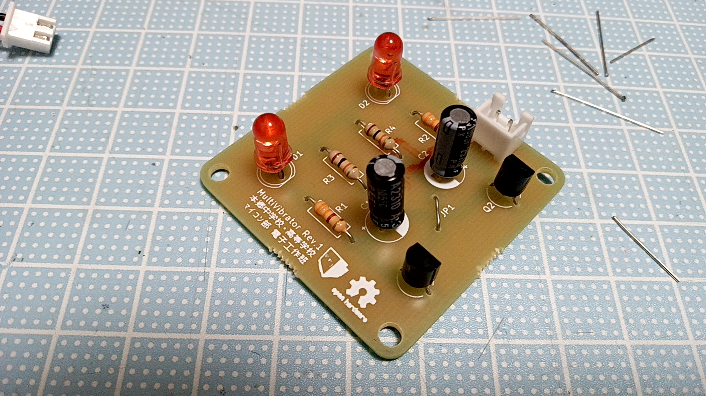

# multivibrator

astable multivibrator soldering practice kit

## bill of materials
- D1, D2: LED
- R1, R2: 330Ω
- R3, R4: 10kΩ
- C1, C2: 100uF
- Q1, Q2: 2SC1815
- J1: [XH Connector](https://akizukidenshi.com/catalog/g/g112247/)
- JP1: Jumper Wire
